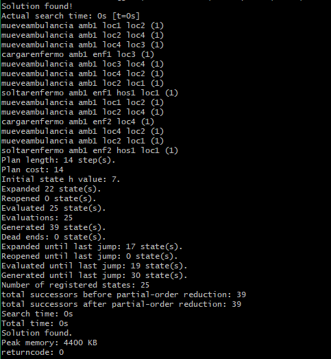
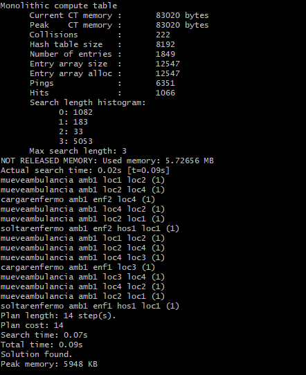
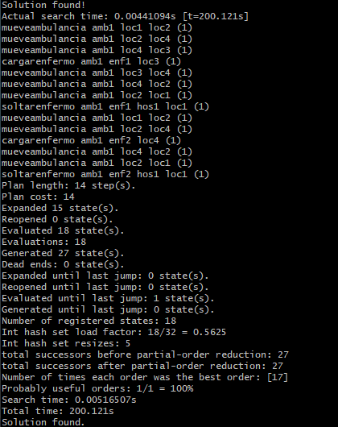

# Actividad 3
## Introducción
Esta es la actividad realizada por Jerónimo Cabezuelo Ruiz para la asignatura Razonamiento y Planificación Automatica del Máster de Inteligencia Artificial de la Universidad Internacional de la Rioja.
En ella tenemos que modelar un ploblema dado en formato PDDL.

## Definición del problema

En el problema planteado tenemos cuatro localizaciones, un hospital, una ambulancia y dos enfermos como la ilustración  

Donde las localizaciones están conectadas L1 con L2, L2 con L4 y L4 con L3, todas en ambas direcciones. La ambulancia y el hospital se encuentran en L1. Y hay un paciente en L3 y otro en L4. El objetivo es trasladar todos los pacientes al hospital. Las acciones que se pueden realizar son:
- Conducir la ambulancia de una posición a otra.
- Subir un paciente a la ambulancia.
- Bajar a un paciente en una localización.

Vamos a ver como modelamos en PDDL.

### Dominio
Lo primero que definimos son los *types*.

    (:types 
        localizacion - object
        elemento - object
        hospital ambulancia enfermo - elemento
    )          
- *localizacion* es un objeto que representará las distintas localizaciones.
- *elemento* son los distintos elementos que podrán estar en las localizaciones
- *hospital* *ambulancia* y *enfermo* son los elementos que pueden estar en las localizaciones

Ahora definimos los *predicates*

    (:predicates 
        (conectados ?loc1 - localizacion ?loc2 - localizacion)
        (localizado ?el - elemento ?loc - localizacion)
        (cargaEnfermo ?amb - ambulancia ?enf - enfermo)
        (cargada ?amb - ambulancia)
        (enHospital ?hos - hospital ?enf - elemento)
        (hospitalizado ?enf - enfermo)
    )

- *conectados* indica si dos localizaciones estan conectadas
- *localizado* este predicado servirá para situar los distintos elementos en las localizaciones
- *cargaEnfermo* nos dice si una ambulancia tiene a un enfermo concreto cargado
- *cargada* nos dice si una ambulancia esta cargada con algún enfermo
- *enHospital* nos dice si un determinado enfermo esta en un determinado hospital
- *hospitalizado este solo dice si un enfermo está en algún hospital
        
Aquí tenemos que hacer un par de apuntes. El primero es que el objeto *elemento* lo definimos para poder localizar cualquiera de los elementos (hospital, enfermo o ambulancia). Por otro lado, cuando un enfermo es trasladado a un hospital lo guardamos en dos predicados distintos, por un lado guardamos que el enfermo está en algún hospital, con *enHospital*, y en otro guardamos en qué hospital está, en *hospitalizado*. Esto lo hacemos para cuando tengamos más hospitales, nos dará igual en que hospital esté lo único que exigiremos es que esté en algún hospital. De igual manera guardamos, con *cargaEnfermo*, qué enfermo es el que está en la ambulancia y en *cargada* simplemente guardamos que la ambulancia esta cargada.
        
Vamos ahora a ver los *action*, la primera es para mover las ambulancias.

    (:action mueveAmbulancia
        :parameters (?amb - ambulancia ?locInicial - localizacion ?locFinal - localizacion)
        :precondition (and 
            (localizado ?amb ?locInicial)
            (conectados ?locInicial ?locFinal)
        )
        :effect (and 
            (not(localizado ?amb ?locInicial))
            (localizado ?amb ?locFinal)
        )
    )
Los parámetros que tenemos son la ambulancia qué se va a mover, la localización inicial donde está la ambulancia y la localización final a la que va la ambulancia. Las precondiciones que necesitamos son que la ambulancia este en la localización inicial y que las dos localizaciones estén conectadas. Y como efectos tendremos que la ambulancia ya no esta en la localización inicial y esta en la nueva localización.

La segunda *action* es para cargar un enfermo en una ambulancia.

    (:action cargarEnfermo
    :parameters (?amb - ambulancia ?enf - enfermo ?loc - localizacion)
        :precondition (and 
            (localizado ?amb ?loc)
            (localizado ?enf ?loc)
            (not(cargada ?amb))
        )
        :effect (and 
            (cargada ?amb)
            (cargaEnfermo ?amb ?enf)
            (not(localizado ?enf ?loc))
        )
    )
En  este caso los parámetros son la ambulancia, el enfermo y la localización. Como precondiciones tenemos que tanto la ambulancia como el enfermo estén en la misma localización y que la ambulancia no esté cargada. Los efectos son que la ambulancia está cargada, también le decimos que esta cargado con el enfermo, es decir, que esta cargada y que carga a este enfermo, y por último quitamos al enfermo de la localización.

La última *action* es para soltar a un enfermo.

    (:action soltarEnfermo
        :parameters (?amb - ambulancia ?enf - enfermo ?hos - hospital ?loc - localizacion)
        :precondition (and
            (localizado ?amb ?loc)
            (localizado ?hos ?loc)
            (cargaEnfermo ?amb ?enf) 
        )
        :effect (and 
            (not(cargada ?amb))
            (not(cargaEnfermo ?amb ?enf))
            (enHospital ?hos ?enf)
            (hospitalizado ?enf)
        )
    )

Los parámetros que tenemos son la ambulancia, el enfermo y la localización. Las precondiciones son que tanto la ambulancia como el hospital estén en la localización y que la ambulancia tenga cargado al enfermo. Los efectos son que la ambulancia no esta cargada y por tanto no esta cargada con el enfermo, que el enfermo esta en el hospital y por tanto el enfermo esta hospitalizado.
        
Todo esto lo podemos encontrar en el fichero [`domainAmbulancias.pddl`](domainAmbulancias.pddl)

### Problema
Dado este dominio, el problema lo modelamos de la siguiente manera. Los objetos que tenemos son las 4 localizaciones, el hospital, la ambulancia y los dos enfermos.

    (:objects 
        loc1 loc2 loc3 loc4 - localizacion
        hos1 - hospital
        amb1 - ambulancia
        enf1 enf2 - enfermo
    )

En el estado inicial tenemos que poner dónde están el hospital, la ambulancia, los dos enfermos y las conexiones entre las localizaciones.

    (:init
        (localizado hos1 loc1)
        
        (localizado amb1 loc1)
        
        (localizado enf1 loc3)
        (localizado enf2 loc4)

        (conectados loc1 loc2)
        (conectados loc2 loc1)
        (conectados loc2 loc4)
        (conectados loc4 loc2)
        (conectados loc4 loc3)
        (conectados loc3 loc4)
    )

Como objetivo simplemente necesitamos que ambos enfermos estén hospitalizados.

    (:goal (and
        (hospitalizado enf1)
        (hospitalizado enf2)
    ))

Esto lo podemos encontrar en el fichero [`problem1.pddl`](problem1.pddl) .

## Planificadores

### Primer planificador
            
El primer panificador que vamos a utilizar es el que trae el propio programa Visual Studio Code (VSC). Que podemos encontrar en [solver.planning.domains/solve](http://solver.planning.domains/solve). La solución la da el propio Visual Studio Code:

 

### Probando otros planificadores

Los planificadores que probaremos son los que nos funcionaron en la primera actividad, DecStar, SYMPLE y Scorpion. Para ello hemos subido a [GitHub](https://github.com/jeronimocabezuelo/actividad3RiPA) los archivos [`domainAmbulancias.pddl`](domainAmbulancias.pddl) y [`problem1.pddl`](problem1.pddl) y hemos seguido las instrucciones de la primera actividad cambiando la dirección del archivo de ejemplo por los de [GitHub](https://github.com/jeronimocabezuelo/actividad3RiPA), para poder descargarlos con vagrant. 

#### DecStar

La ejecución se produce sin problemas y nos arroja el una solución ([Solución DecStar](img/solucionDecStar.png)) en este caso primero recoge al segundo enfermo VSC

#### SYMPLE

 De igual modo, cuando ejecutamos el planificador SYMPLE nos arroja la misma solución ([Solución SYMPLE](img/solucionSYMPLE.png)) que con el planificador predeterminado de VSC. 

 
 

#### Scorpion
En este caso, nos ocurre igual que en la primera actividad, tarda más de 200 segundos en devolver la solución, pero finalmente también devuelve una solución ([Solución Scorpion](img/solucionScorpion.png)), en la cual  la ambulancia recoge primero al enfermo 1.

